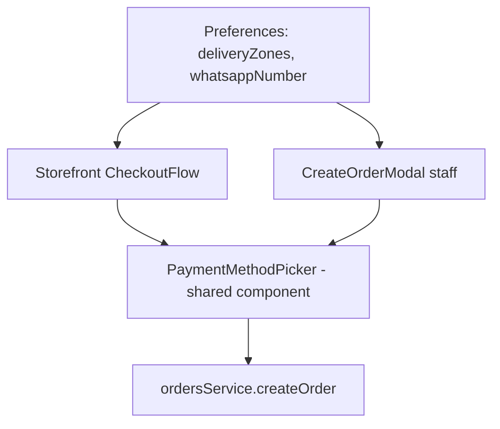

# order-ui — Master Business Rules & Data Flow (English source)

Status vocabulary used throughout:
- **Implemented** — rule is real, working code today.
- **Partially implemented** — some of the rule is built, some isn't.
- **Planned (not implemented)** — decided in a spec, zero code exists yet (mostly Phase 10/11 items).
- **Diverges from current code** — a rule exists (in spec or as an implied invariant) but the code contradicts or doesn't enforce it. This is the category the upcoming fix pass should prioritize.
- **[NEW]** — drafted in this pass from restaurant-domain + BR-market judgment, not previously decided in any spec. Needs user confirmation before being treated as settled.

Scope: covers Phases 0-9 (built) and Phase 10/11 (planned, from the core-package spec) of the restaurant-ops redesign. Two prior specs are the primary source for already-decided rules: `2026-09-09-restaurant-ops-redesign-design.md` and `2026-09-15-core-package-br-i18n-ux-design.md`.

---

## 1. Orders & Channels

1. An order has exactly one channel: `Online`, `Dine-in`, or `Phone`. Online = customer self-service (Storefront); Dine-in = table-scoped; Phone = staff-taken. **Implemented.**
2. Staff (Orders admin "New Order") may only create `Phone` or `Dine-in` orders, never `Online` — Online is self-service-only via Storefront checkout. **Implemented.**
3. `Dine-in` orders must reference a real `Table`; `Phone` orders must specify a `Fulfillment` (`Pickup`/`Delivery`); `Online` orders always carry `fulfillment`. **Implemented.**
4. A `Phone`+`Delivery` order requires an active delivery zone; Delivery is only offered when ≥1 zone is active. **Implemented.**
5. Order IDs are server-generated, channel-prefixed (`DEL-`/`DIN-`/`PHN-`) + year + random suffix; client never supplies an id. **Implemented.** (Cosmetic note: `Online` orders get the `DEL` prefix even when Pickup-fulfilled — a naming mismatch, not a functional bug.)
6. **[NEW]** Order total should be the authoritative sum of real menu-item prices, immutable once created except by amending lines pre-submission. **Diverges from current code**: `CreateOrderModal` lets staff free-type item name/qty/price with no reference to the real `MenuItem` catalog — no price validation against the menu exists for staff-created Phone/Dine-in orders.

### Status lifecycle
7. `OrderStatus` is `New → Preparing → Ready → Completed`, with `Cancelled` reachable from any non-terminal state. **Implemented structurally, diverges in enforcement**: `updateOrderStatus` accepts any transition unconditionally — nothing stops going `Completed` back to `New`, or skipping straight to `Completed`. KDS's own UI assumes forward-only progression but the mock backend doesn't enforce it.
8. **[NEW]** A `Cancelled` order should be immutable. **Diverges from current code** — no guard exists (currently safe only because no UI path re-opens a cancelled order).
9. Cancelling is a status change, never a hard delete — history is preserved. **Implemented.**
10. KDS only shows `New`/`Preparing`/`Ready` orders — `Completed`/`Cancelled` disappear immediately. **Implemented.**
11. KDS advances one step at a time via a single primary action, no skip/send-back. **Implemented as a UI constraint** (not a data-layer one — see #7).
12. **[NEW]** "Ready" should be fulfillment-aware (courier pickup / customer pickup / serve to table). **Planned (not implemented)** — one generic "Ready" label covers every fulfillment today.
13. **[NEW]** A `Completed` order should be read-only. **Diverges from current code** — no field-level lock exists (safe only by omission of any UI path).

### Payment status & method (Order-level)
14. `PaymentStatus` (`Paid`/`Pending`/`PayLater`) is distinct from `OrderStatus`. **Implemented.**
15. **[NEW]** Marking payment "received" is implicit in advancing to `Completed`, not a separate screen. **Diverges from current code**: `CreateOrderModal` hardcodes every staff-created order's `paymentStatus` to `"PayLater"` regardless of the chosen `paymentMethod` — contradicts the spec's own rule ("PayLater for Cash, Paid otherwise") that Storefront's `CheckoutFlow` implements correctly. This is a real, high-confidence bug.
16. A `Cash` payment may optionally record `changeFor`. **Implemented.**
17. A `Card` payment must specify `cardType` (`Credit`/`Debit`) before submit. **Implemented.**

### Order creation
18. **[NEW]** A newly created order should always start at `status: "New"` — status is not staff-selectable at creation. **Diverges from current code**: `CreateOrderModal` exposes a full status `<select>` (including `Cancelled`) at creation time, bypassing the kitchen queue entirely. Likely leftover from an earlier "quick edit" affordance.

## 2. Track-order (public, unauthenticated)

19. A customer can look up live status without login via order id + checkout phone (normalized match). **Implemented.**
20. The tracking view polls for live status (no push/WebSocket) only while mounted, same interval as KDS. **Implemented.**
21. **[NEW / contradicts existing spec decision]** Status timeline copy should be fulfillment-aware (different label sets for Delivery/Pickup/Dine-in per the core-package spec). **Diverges from current code** — one generic label set is used for every order today; the spec's fulfillment-aware copy was never implemented.
22. A cancelled order shows a distinct state, not a timeline position. **Implemented.**
23. **[Known, already flagged in roadmap]** The public lookup fetches the entire order list client-side and filters in-browser rather than a scoped lookup. **Acceptable for mock; a real backend must expose a scoped endpoint**, not ship the whole order list to an unauthenticated route.
24. **[NEW, partially superseded]** `Order.etaMinutes` should be a creation-time snapshot. **Partially implemented**: the zone's own `etaMinutes` is snapshotted correctly, but the spec's richer `estimatedDeliveryMinutes = avgPrepTimeMinutes + avgDeliveryTimeMinutes` field doesn't exist — no `avgPrepTimeMinutes` is captured anywhere.

## 3. Menu & Stock

25. `features/menu` is the sole source of truth for `MenuItem` — no feature keeps a local duplicate fixture. **Implemented.**
26. A `MenuItem` with `available === false` must never appear in a customer-facing view. **Implemented for Table-Menu**; **Storefront's own filtering is unverified** — storefront has no visible `available` filter of its own and appears to rely on upstream filtering that doesn't exist, a likely divergence worth confirming in the fix pass.
27. Low stock (`0 < stockQuantity <= 5`) is a warning, not a gate; only the 86-toggle removes an item from ordering. **Implemented.** **[NEW]**: should `stockQuantity` reaching 0 auto-flip `available` to false? Today it doesn't — an admin can save `stockQuantity: 0, available: true` with no validation.
28. The 86-toggle is instant and reversible, a boolean flip. **Implemented.**
29. A `MenuItem` can be hard-deleted, not just hidden. **Implemented, but [NEW] flagged**: recommend blocking hard delete once an item has order history (dangling `menuItemId` references), forcing the 86-toggle path instead.
30. Name is the only required field; price/stock silently default to 0 on invalid input. **Implemented, but [NEW] flagged** as risky: a fat-fingered price field can publish a free item — recommend requiring price > 0.
31. Categories are a fixed static list, not owner-manageable. **[NEW]**: decide whether owner-editable categories belong in Core or stay deferred.
32. The data model implies a "custom/ad hoc order line not on the menu" capability (an order line references a nonexistent `menuItemId` in seed data) but no UI exposes creating one. **Diverges / incomplete.**
33. Menu admin cards render prices with a hardcoded `$` instead of `formatCurrency` — breaks BRL display even when the language is Português. **Diverges from current code** (same bug class as `CartOverlay`, previously unflagged on this screen).

## 4. Tables & Comandas

34. A `Table` is `{id, name, qrCodeUrl}` only — no seating/occupancy state. **Implemented as-is**; the core-package spec's `status: "Free"|"Occupied"` addition is **Planned (not implemented)** — confirmed zero occurrences of `Comanda`/`comandaId`/table `status` anywhere in the codebase.
35. Every `Table`'s QR code deep-links to the public `/table-menu?table=<id>` route. **Implemented.**
36. A `Table` can be deleted freely, no check for open/linked orders. **Implemented** (no problem today since nothing links Order→Table in a way deletion orphans); **[NEW]**: once Comandas exist, deleting a table with an Open comanda must be blocked or force-closed first.
37. The public table lookup reuses the same data source as the authenticated admin roster, with an explicit code comment warning against wiring it to the admin-scoped endpoint later. **Diverges from current code (documented, intentional)** — fine only while mock.
38. **Comandas are fully specified in the core-package spec but have zero implementation** — confirmed via grep. **Planned (not implemented).** Carries forward as a block of sub-rules: Shared mode = one Comanda for the table, decided once at seating, not changeable mid-visit; Individual mode = one Comanda per named guest, never customer-editable; `/table-menu` self-order only works on an Open+Shared comanda; "Chamar garçom"/"Pedir a conta" post to the notification feed; closing a comanda reuses the PIX/Card/Cash picker and flips the table back to Free once all its comandas are closed.

## 5. Payment method

39. All Core payment methods are in-person/mock — no real gateway ever touches the app; PIX is a self-confirming mock QR/copia-e-cola flow. **Implemented.**
40. Choosing Card reveals a required Crédito/Débito sub-choice; no card details ever collected in-app. **Implemented.**
41. Choosing Cash reveals an optional "Troco para quanto?" field. **Implemented.**
42. One shared picker component drives every payment-method context (Storefront checkout, staff `CreateOrderModal`). **Implemented.**
43. Payment method is real, persisted `Order` data, visible to staff. **Implemented.**
44. Marking payment "received" is implicit in advancing the order/comanda to Completed/closed. **Implemented for single orders; Planned (not implemented) for comandas** (comandas don't exist yet).
45. Cash defaults `paymentStatus` to `PayLater`; PIX/Card default to `Paid`. **Implemented in Storefront's `CheckoutFlow`; see rule 15 — `CreateOrderModal` diverges (hardcodes `PayLater` always).**
46. **[NEW]** Payment method should not be editable after order creation. No UI path exists to edit it today (not fully verified against `OrderDrawer`).
47. **[NEW]** No minimum order value is enforced for Delivery. Real BR delivery businesses commonly set one — worth deciding before the fix pass.
48. **[NEW]** No refund/cancellation payment-status rule exists — what happens to `paymentStatus` when an already-`Paid` order is cancelled is undefined.

## 6. Delivery zones & fulfillment gating

49. Storefront must offer an explicit Retirada/Entrega choice before checkout, not a hardcoded delivery-only flow. **Implemented.**
50. If no active delivery zones are configured, "Entrega" must not be offered as a working option. **Implemented as disabled-with-explanation** (spec says "doesn't appear at all" — a UX judgment-call divergence between hidden vs. disabled, functionally equivalent).
51. Owner configures a named-zone list (bairro, no map/geocoding), each with a fee and ETA. **Implemented, but diverges from the spec's exact field model**: the spec described flat owner-level `avgPrepTimeMinutes`+`avgDeliveryTimeMinutes`; the actual implementation puts `etaMinutes` per zone instead, and Pickup uses a hardcoded, non-configurable `PICKUP_ETA_MINUTES = 15` constant — no owner-facing "avg prep time" field exists anywhere.
52. Customer picks bairro from a dropdown seeded with exactly the owner's list (not free text). **Implemented.**
53. If the bairro isn't covered, show a message with a "Trocar para Retirada" offer, surfaced via a "Meu bairro não está na lista" dropdown option. **Diverges from current code — not implemented**: no such option/fallback exists; an uncovered customer simply can't select Delivery, with no explanation.
54. The rest of the address (rua, número, complemento) is free text on `Order.deliveryAddress`. **Planned (not implemented)** — no street-address fields exist anywhere; a delivery order today carries only a neighborhood name and phone number. High-priority real gap.
55. ETA is snapshotted onto the order at creation time. **Implemented, under a different field name** (`Order.etaMinutes`, not the spec's proposed `estimatedDeliveryMinutes`) — functionally correct, naming diverges.
56. A WhatsApp business number gates the "Continuar no WhatsApp" affordance. **Partially implemented**: the number field and the staff-side deep links exist; the customer-facing confirmation-screen link does not — `SuccessView` only has "Track Order"/"Back to Menu".
57. Delivery fee is added to the total and shown as a line item. **Implemented.**
58. Known bug: `CartOverlay` and `CheckoutFlow`'s zone-picker option label hardcode a literal `$` instead of `formatCurrency`. **Diverges from current code** — breaks BRL formatting for PT-BR users. High-confidence, low-effort fix candidate.

## 7. Administration (Team/Roles/Audit Log — real backend)

59. User lifecycle is invite → active → deactivated ⇄ reactivated, never deleted. **Implemented.**
60. `GET /users` list rows carry no name — full name requires `GET /users/{id}`. **Implemented (documented data-shape constraint).**
61. Audit log and role catalogue are read-only, `SUPER_ADMIN`-gated reference surfaces. **Implemented.**
62. **[NEW]** No audit-log retention/export rule is defined — may matter for LGPD accountability later. **Planned (not implemented)**, purely a gap surfaced here.
63. **[NEW]** Role names must stay in lockstep between the client's closed `Role` union and the backend's `GET /roles`. **Diverges from current code** — a latent risk: if the backend adds/renames a role, `normalizeRole` silently drops it to `USER`, and hardcoded `RoleGuard.allowedRoles` won't recognize it either.

## 8. Authentication & Session

64. Auth is JWT-based, client-decoded from `accessToken`/`refreshToken` in `localStorage`; the `User` is derived from the JWT payload, not a `/me` call. **Implemented.**
65. Role resolution is defensive, defaults to `USER` if nothing resolves — never zero roles. **Implemented.**
66. Two-layer route protection: `ProtectedLayout` (token presence only, no expiry check) then `RoleGuard` (role match, only on `/administration/*`), redirecting to `/login` vs `/home` respectively. **Implemented.**
67. Admin sub-areas have different minimum roles: Team needs `ADMIN`+, Roles/Audit Log need `SUPER_ADMIN` only. **Implemented.**
68. **[NEW]** Logout is unconditionally client-side — no server-side token revocation happens (the real logout endpoint call is commented out). **Diverges from current code** — a lost device's token isn't actually invalidated by "logging out" elsewhere.
69. **[NEW]** Self-service `/register` exists alongside admin-driven invite with no stated relationship between the two paths — unclear whether open registration should even be reachable for an internal restaurant-ops tool. **Diverges from current code (inconsistent, not evaluated as right/wrong)** — needs a decision.

## 9. Profile

70. Profile is self-service, real-backend, single-endpoint round-trip (`GET/PATCH /me/profile`) — distinct from Administration's narrower admin-edits-another-user shape. **Implemented.**
71. Avatar upload is a mock no-op — nothing is actually persisted despite the UI implying it saved. **Diverges from current code** — a `connect-backend` gap.

## 10. Settings

72. **[NEW]** "Security" settings (2FA, login alerts, API keys, active sessions, delete account) are all mock/no-op — nothing real happens when toggled. **Diverges from current code**, and is a materially different risk class than other mocks: a security control that silently does nothing while a restaurant owner believes it's protecting their account is a trust concern, not just an incomplete feature.

## 11. Preferences (device-scoped)

73. Preferences (language, theme, timezone, currency, date format, font size, sidebar mode) are device-scoped via `localStorage`, not account- or store-scoped. **Implemented as device-scoped** — flagged as architecturally significant: two staff sharing one till/tablet share these implicitly; the same staff member on a second device gets defaults again. **[NEW]**: should language/currency/date-format eventually be account- or store-scoped? Recommend deferring until a real Preferences backend exists, but worth deciding the target shape now.
74. Default language is BR-first: `navigator.language` starting with `en` → English, anything else → Português (Brasil); a saved choice always wins. **Implemented.**
75. Legacy/unrecognized saved language values self-heal to the nearest current option rather than breaking the UI. **Implemented.**
76. Currency/date-format defaults follow the resolved language but remain independently overridable afterward. **Implemented.**

## 12. Home dashboard

77. "Today" for the dashboard snapshot is the most recent `createdAt` date present in the order data, not the real calendar date — a deliberate mock-data accommodation (fixture dates are fixed in the past). **Implemented, but must revert to the real calendar date once a real backend lands** — this is a mock-only rule, not a production one.
78. Today's snapshot counts orders whose `createdAt` equals the snapshot date; revenue/avg-order-value additionally exclude Cancelled orders ("billable" orders). **Implemented.**
79. Kitchen backlog count is right-now, not "today"-scoped — counts every `New`/`Preparing` order across all dates. **Implemented — intentional divergence from the other today-scoped tiles**, correct restaurant-ops behavior; flagged explicitly so a future consistency pass doesn't "fix" it into matching the others.
80. Low-stock alert: `available === true` AND `0 < stockQuantity <= threshold`; zero-stock (86'd) items excluded. **Implemented**, single shared threshold constant (no duplication).
81. Four quick actions: New Order, Open KDS, View Menu, Copy Ordering Link. **Implemented.** **[NEW]**: "Copy Ordering Link" copies a relative path (`/storefront`), not an absolute URL — a restaurant owner sharing it via WhatsApp/Instagram needs a full URL. Likely a real gap.

## 13. Analytics

82. KPI definitions: Total Revenue = sum of non-Cancelled order totals (all-time); Total Orders = count of ALL orders including Cancelled; Avg Order Value = Revenue / billable count; Cancellation Rate = cancelled/all. **Implemented.** **[NEW]**: Total Orders including Cancelled while the other three KPIs exclude it is internally inconsistent — decide whether a separate "Cancelled" KPI would be clearer.
83. Revenue-over-time and order-volume-by-day are grouped by date, not hour (Phase 6's documented adaptation of the spec's literal "peak-hours heatmap", since no hour-of-day data exists). **Implemented — diverges only in naming**: the component/type are still called "Heatmap" though they render day-granularity bars, not an hour grid. Cosmetic rename candidate.
84. Top Items: top 5 by quantity sold, all-time, non-Cancelled. **Implemented.**
85. No trend/percentage-change badges anywhere (no prior-period baseline in mock data). **Implemented (intentional omission).**
86. Analytics KPI currency values are hardcoded with a literal `$`, bypassing `formatCurrency`/i18n entirely. **Diverges from current code** — contradicts the i18n presentation-boundary rule and the spec's explicit BRL requirement. High-confidence fix-pass candidate, same bug class as Menu/CartOverlay/CheckoutFlow.

## 14. Notifications

87. The core-package spec's rule ("an order status change appends a mock 'Mensagem enviada via WhatsApp' entry to the notification feed") is **not implemented** — the real WhatsApp deep-link actions (Phase 9) live entirely in Orders/KDS via `wa.me` links and never write into the Notifications feed. The two systems are completely disconnected.
88. `features/notifications`' entire content is unmigrated pre-redesign generic B2B-procurement demo data ("Shipment Alerts", "Purchase Orders", "Login Alerts") — the only feature module untouched by any of Phases 0-9. **Diverges from the whole initiative's intent.** **[NEW, high priority]**: should Notifications be rebuilt with restaurant-relevant categories (order status changes, low-stock alerts, Chamar garçom/Pedir a conta, WhatsApp-send confirmations) wired to real app events? This looks like an unintentional gap, not a stated non-goal.
89. **[NEW]** Notification preferences (mute/category toggles) are saved via a mock call that discards the value on reload — unlike `preferences` (localStorage-backed). Should this persist the same way?
90. **[NEW]** Notifications are global/per-installation, not scoped per authenticated user. Is per-user notification history needed for a multi-staff restaurant, or is a single shared feed correct for a small operator?

## 15. Internationalization (i18n)

91. Two locales only: `en` and `pt-BR`, namespaced per feature (15 namespaces). **Implemented.**
92. English is canonical and the fallback locale — a missing pt-BR key renders the English string, never blank/raw key. **Implemented.**
93. Default resolution: saved `preferences.language` always wins; otherwise `navigator.language` starting with `en` → English, else → pt-BR. **Implemented exactly as specified.**
94. Runtime switching, no reload — changing language updates all mounted UI immediately, public and authenticated routes alike (since `PreferencesProvider` sits above the router split). **Implemented.**
95. The old hand-rolled i18n mechanism (`translations.ts`/`useTranslation()`, French/Spanish, 2-file coverage) is fully deleted, not left dormant. **Implemented.**
96. Presentation-boundary only: translation never touches stored domain/enum values. **Implemented by convention** — not spot-checked render-site-by-render-site across all 15 namespaces in this pass.
97. BRL currency formatting and DD/MM/YYYY date formatting apply when the active language is pt-BR. **Not verified in this pass** (`src/utils/format.ts` not read by any fork) — flag for a direct check before treating as confirmed.

---

## Data Flow (master)

### Layering convention (applies to every mock feature)
`Component → Hook (TanStack Query) → Service (module-level mutable array or localStorage) → mock store`. Every mock service method carries a `// TODO: connect-backend` comment naming the intended real endpoint. Only **Auth**, **Profile**, and **Administration** (Team/Roles/Audit Log) call the real backend via `src/api/client.ts` (axios) today; every other feature (Orders, KDS, Menu, Tables, Table-Menu, Track-order, Storefront, Home, Analytics, Notifications, Settings, Preferences) is mock-backed.

### Orders / KDS / Track-order / Storefront checkout / staff CreateOrderModal
Single shared TanStack Query cache key `["orders"]` across Orders admin, KDS (filtered client-side to New/Preparing/Ready), and Track-order (filtered client-side to one order). A status change anywhere invalidates this one key, so KDS ↔ Orders ↔ Track-order stay consistent within a session. Both customer order-creation (Storefront `useStorefront.placeOrder` → `ordersService.createOrder`) and staff order-creation (`CreateOrderModal` → same `ordersService.createOrder`) converge on the exact same mock function and cache key — one order-creation code path, not two divergent ones.

```mermaid
flowchart LR
    SF[Storefront CheckoutFlow] -->|placeOrder| OS[ordersService.createOrder]
    COM[CreateOrderModal staff] -->|createOrder| OS
    OS --> CACHE[["orders"] TanStack Query cache]
    CACHE --> ORD[Orders admin]
    CACHE --> KDS[KDS - New/Preparing/Ready]
    CACHE --> TRK[Track-order public]
    CACHE --> HOME[Home dashboard]
    CACHE --> ANA[Analytics]
```

### Menu & Stock
`menuService` (module-level mutable array) is the single source; `table-menu` and `storefront` both read through it (though Storefront's own `available` filtering is unverified — flagged as a possible gap). `Order.items[].menuItemId` is a **denormalized snapshot** (name/unitPrice copied at creation time) — historical orders never change when menu prices change, but there is no referential-integrity check back to the live menu.

### Tables / Table-Menu
Admin `useTables()` and public `useTableMenu()`'s `["tables", tableId]` query are two independent cache entries over the same underlying mock array — not a shared cache key. The public `/table-menu` route composes `menuService` + `tablesService` reads (same cross-feature composition pattern Home/Analytics later reused).

### Payment & Delivery

One shared `PaymentMethodPicker` component and one delivery-zone data source (`preferences.deliveryZones`) feed both the customer (Storefront) and staff (CreateOrderModal) order-creation paths — no divergent reimplementation.

### Administration / Auth / Profile (real backend)
```
LoginForm → useLogin → authService.loginRequest (POST /auth/login, real)
  → accessToken/refreshToken → localStorage
  → useAuth() decodes JWT client-side, normalizes roles (never zero roles)

Route access: ProtectedLayout (token present?) → AppLayout (shell) → RoleGuard (role match, /administration/* only)

TeamFeature/RolesFeature/AuditLogFeature → real GET/POST/PATCH against /users, /roles, /admin/identity-audit
ProfileFeature → real GET/PATCH /me/profile (avatar upload is the one mock seam here)
```
`/storefront`, `/kds`, `/table-menu`, `/track-order` bypass both auth layers entirely — registered as top-level router children, not nested under `ProtectedLayout`.

### Preferences (global, mock, localStorage)
`App.tsx` wraps the entire router in `PreferencesProvider`, above `ProtectedLayout`, so public routes get it too. On mount, reads `localStorage["preferences"]`, merges over defaults, canonicalizes legacy values. A `preferences.language` change flows through `resolveLanguage` → `i18n.changeLanguage(...)`, propagating live to every mounted `useTranslation()` consumer app-wide, no reload. `preferences.theme`/`fontSize`/etc. are pure DOM side effects (document attribute toggles), not consumed by any feature's data layer. Consumers outside the Preferences feature itself: `i18n/config.ts`, `Sidebar`, and `orders`/`storefront`/`table-menu` (for `formatCurrency`/`formatDate` and `whatsappNumber`/`deliveryZones`).

### Home / Analytics (cross-feature composition, no owned data)
Both compose `ordersService.getOrders()` + `menuService.getMenuItems()` at read time rather than owning any data — same pattern `table-menu` established. Home issues one composed query (`["home","dashboard"]`); Analytics issues 5 independent queries that each independently re-fetch the same underlying order/menu data (harmless with an in-memory mock array; a real-backend concern — 5x round-trips for what could be 1 — for whoever eventually connects it). Neither auto-invalidates on an Orders/Menu mutation elsewhere — they pick up changes on their own next fetch/mount (eventual consistency within a session, not push).

### i18n
Runs at module-import time, before the app renders: reads `localStorage["preferences"]` directly (not through the Preferences service, so it can run before React mounts), resolves `en`/`pt-BR`, initializes all 15 namespaces eagerly (no lazy-loading). `PreferencesProvider` owns the runtime-switch path post-mount.

### Notifications (isolated)
Reads only its own static constants / a mock `notificationsService` — zero data-flow connection from `ordersService`, KDS, or the real WhatsApp deep-link utility (`src/utils/whatsapp.ts`). Fully isolated from the rest of the app's data graph.
