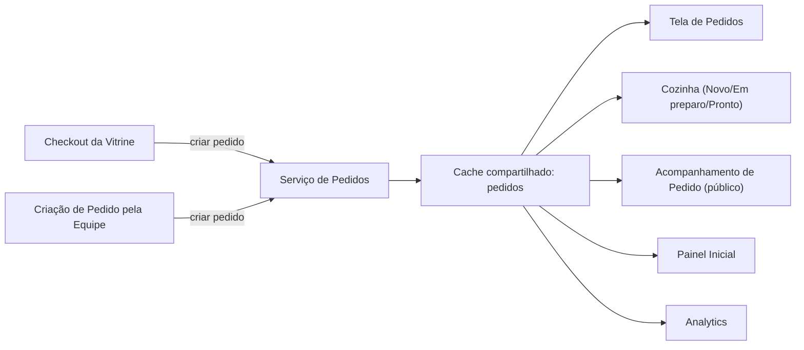
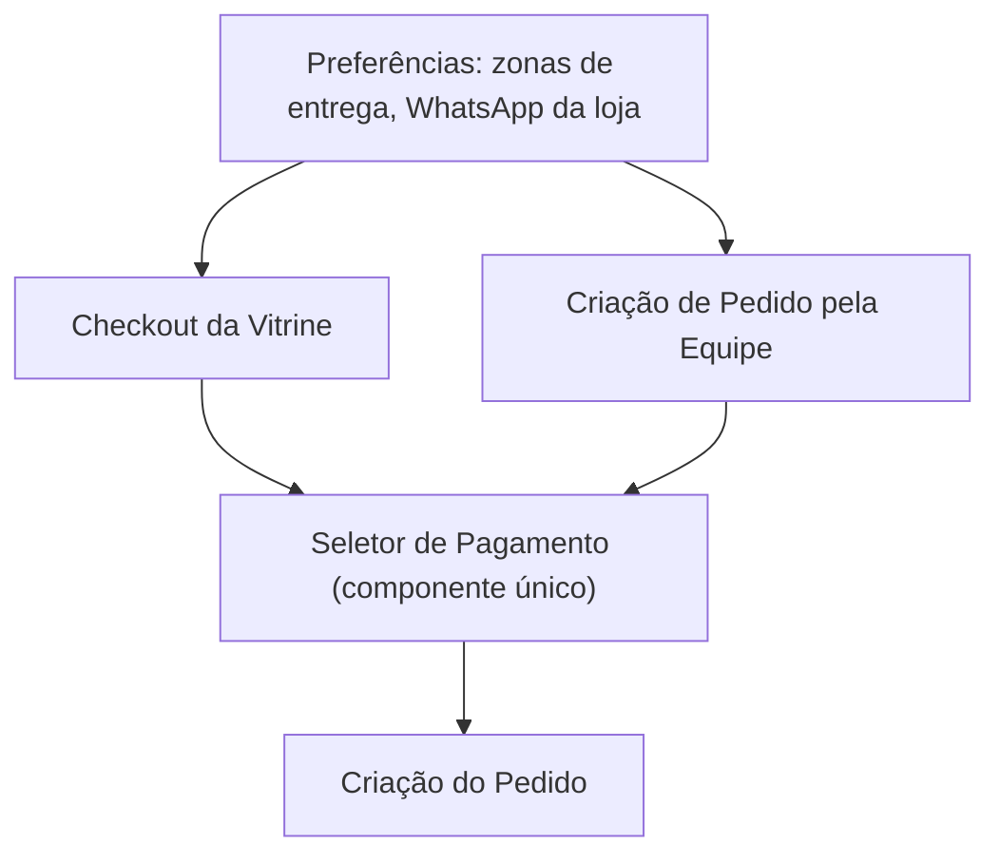
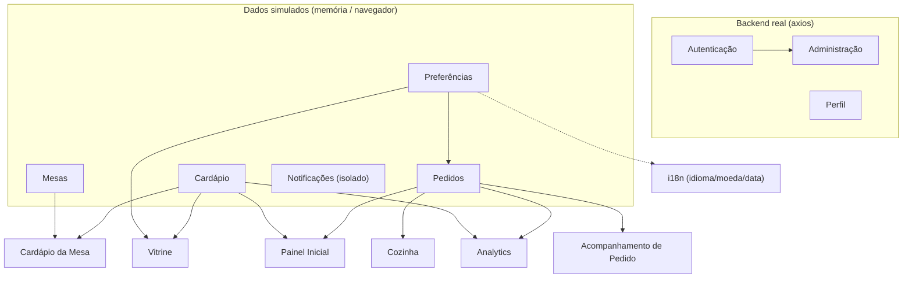

# Fluxo de Dados — order-ui (Operação de Restaurante)

Este documento descreve, sob a ótica de engenharia de software, como os dados circulam entre as áreas do sistema: camadas, fronteira entre dados simulados e backend real, chaves de cache compartilhadas e os pontos onde uma área lê dados de outra. É o complemento técnico do documento `2026-09-16-regras-de-negocio.md`.

## Convenção de camadas (vale para toda área com dados simulados)

```
Componente → Hook (TanStack Query) → Serviço (array em memória ou localStorage) → "banco" simulado
```

Todo método de serviço simulado carrega um comentário `// TODO: connect-backend` indicando o endpoint real pretendido. Hoje, **apenas três áreas conversam com um backend real** via `src/api/client.ts` (axios): **Autenticação**, **Perfil** e **Administração** (Equipe/Papéis/Log de Auditoria). Todas as demais áreas — Pedidos, Cozinha (KDS), Cardápio, Mesas, Cardápio da Mesa, Acompanhamento de Pedido, Vitrine, Painel Inicial, Analytics, Notificações, Configurações e Preferências — são inteiramente simuladas.

## Pedidos / Cozinha / Acompanhamento / Checkout da Vitrine / Criação de Pedido pela Equipe

Uma única chave de cache compartilhada (`["orders"]`) é usada pela tela de Pedidos, pela Cozinha (filtrando no navegador para `Novo`/`Em preparo`/`Pronto`) e pelo Acompanhamento de Pedido (filtrando para um único pedido). Uma mudança de status em qualquer lugar invalida essa mesma chave, então Cozinha, Pedidos e Acompanhamento permanecem consistentes dentro de uma mesma sessão do navegador. Tanto a criação de pedido pelo cliente (Vitrine) quanto pela equipe (tela de Pedidos) convergem para a **mesma** função de criação de pedido e a **mesma** chave de cache — existe apenas um caminho de criação de pedido no backend simulado, não dois caminhos divergentes.



## Cardápio & Estoque

O serviço de Cardápio (array mutável em memória) é a única fonte de dados; tanto o Cardápio da Mesa quanto a Vitrine leem através dele (embora a filtragem própria de disponibilidade da Vitrine não tenha sido confirmada como existente — ver regra de negócio nº 26). Cada linha de um pedido guarda um **retrato** (nome/preço no momento da criação) — pedidos históricos nunca mudam quando o preço do cardápio muda, mas também não existe nenhuma verificação de integridade entre a linha do pedido e o cardápio ao vivo.

## Mesas / Cardápio da Mesa

A listagem administrativa de mesas e a busca pública de uma mesa específica usam chaves de cache **independentes**, ainda que sobre o mesmo array simulado — não compartilham uma única entrada de cache. A rota pública `/table-menu` combina leituras do serviço de Cardápio e do serviço de Mesas, no mesmo padrão de composição entre áreas que o Painel Inicial e o Analytics usam depois.

## Pagamento & Zonas de Entrega



Um único componente de seleção de pagamento e uma única fonte de dados de zonas de entrega (configurada em Preferências) alimentam tanto o caminho do cliente (Vitrine) quanto o da equipe (criação de pedido) — sem reimplementação divergente entre os dois.

## Administração / Autenticação / Perfil (backend real)

```
Login → autenticação real (POST /auth/login)
  → tokens salvos no navegador
  → usuário decodificado do token no cliente, papel nunca fica vazio

Acesso à rota: verificação de token → estrutura visual do painel → verificação de papel (somente rotas de Administração)

Equipe / Papéis / Log de Auditoria → chamadas reais (GET/POST/PATCH) contra /users, /roles, /admin/identity-audit
Perfil → GET/PATCH reais em /me/profile (o upload de avatar é a única simulação nesta área)
```

As rotas públicas (`/storefront`, `/kds`, `/table-menu`, `/track-order`) não passam por nenhuma das duas camadas de proteção — são registradas fora da estrutura autenticada do aplicativo.

## Preferências (global, simulado, salvo no navegador)

O componente que provê as Preferências envolve toda a aplicação, inclusive as rotas públicas, sem depender de autenticação. Ao carregar, lê o valor salvo no navegador, mescla com os padrões, e corrige valores antigos de idioma que não existem mais. Uma mudança de idioma propaga em tempo real para toda a interface montada, sem recarregar a página. Preferências de tema/fonte/etc. são efeitos visuais diretos (atributos do documento), não são consumidas pela camada de dados de nenhuma área. Consumidores fora da própria área de Preferências: o motor de i18n, o menu lateral, e as áreas de Pedidos/Vitrine/Cardápio da Mesa (para formatação de moeda/data e para o número de WhatsApp/zonas de entrega).

## Painel Inicial / Analytics (composição entre áreas, sem dados próprios)

Ambas as áreas compõem dados do serviço de Pedidos e do serviço de Cardápio no momento da leitura, em vez de possuir dados próprios — mesmo padrão que o Cardápio da Mesa já usava. O Painel Inicial faz uma única consulta combinada; o Analytics faz 5 consultas independentes que cada uma relê os mesmos dados de pedidos/cardápio (inofensivo com um array simulado em memória; um ponto de atenção para quando existir um backend real — 5 idas e voltas de rede para o que poderia ser 1). Nenhuma das duas áreas é atualizada automaticamente quando um Pedido ou item do Cardápio muda em outro lugar — a atualização acontece apenas na próxima vez que a própria tela for carregada (consistência eventual dentro da sessão, não em tempo real).

## Internacionalização (i18n)

É inicializado antes mesmo da aplicação renderizar: lê a preferência de idioma salva diretamente do navegador (sem passar pelo serviço de Preferências, justamente para poder rodar antes de tudo), resolve entre Inglês/Português, e carrega todas as 15 áreas de tradução de uma vez (sem carregamento sob demanda). Depois que a aplicação já está de pé, o componente de Preferências assume o caminho de troca em tempo real.

## Notificações (isolado)

Lê apenas suas próprias constantes estáticas / um serviço simulado próprio — **nenhuma conexão de dados existe** entre esta área e o serviço de Pedidos, a Cozinha, ou o utilitário real de links de WhatsApp. Está completamente isolada do restante do grafo de dados (mesmo que simulado) do sistema.

---

## Diagrama geral de dependências entre áreas


